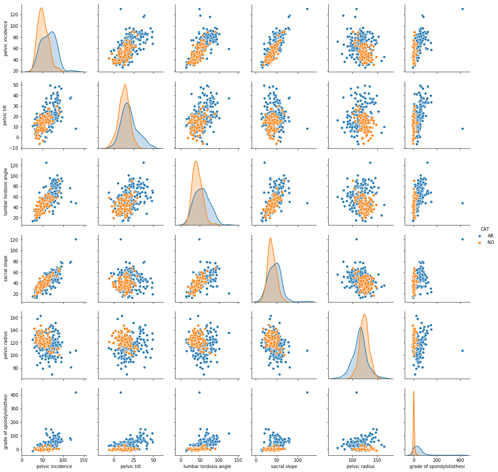
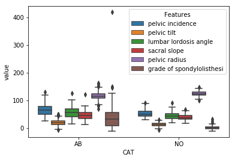
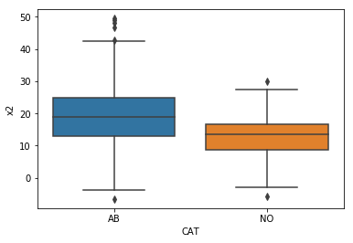
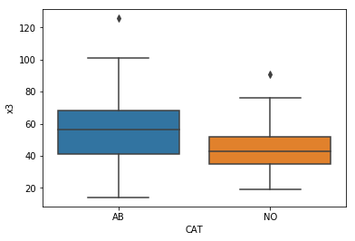
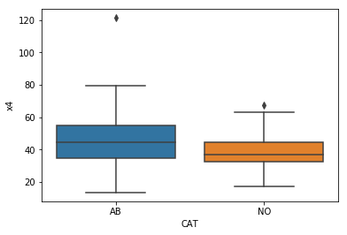
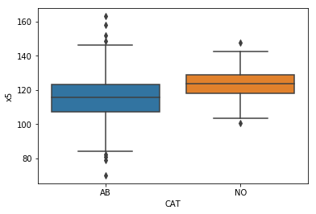
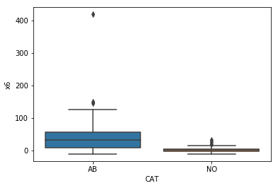
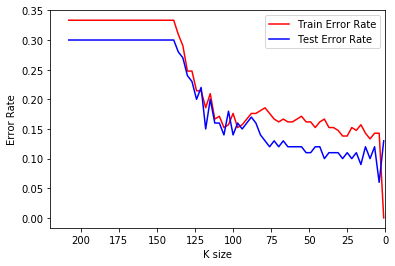
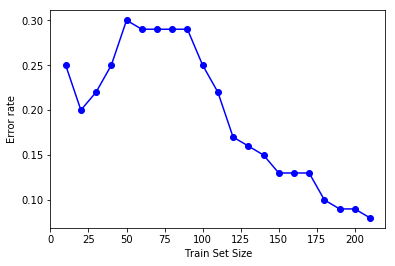

# homework-1-ruifan831
homework-1-ruifan831 created by GitHub Classroom

                    Name: RUIFAN XU          STUDENT ID: 1995124351

    B i: Make scatterplots of the independent variables in the dataset. Use color to show Classes 0 and 1.

    B ii: Make boxplots for each of the independent variables. Use color to show Classes 0 and 1

    C) ii. Which k* is the most suitable k among those values?

    Minimum Error Rate: 0.06
    Optimal K: 4
    Confusion Matrix: [[25  5]
                       [ 1 69]]
    True Positive Rate: 0.9857
    True Negative Rate: 0.8333
    Precision: 0.9324
    F score: 0.9583
                  precision    recall  f1-score   support
    
               0       0.96      0.83      0.89        30
               1       0.93      0.99      0.96        70
    
       micro avg       0.94      0.94      0.94       100
       macro avg       0.95      0.91      0.93       100
    weighted avg       0.94      0.94      0.94       100
    

    C) iii. Plot the learning curve by changing training set size

    D) iA. Best k and test error at k = k* while using Manhattan Distance

    Optimal K: 26
    Error Rate: 0.11

    D) iB. What is the best log10(p) at k=k* in iA?

    Best log(p) :0.1
    Error Rate: 0.1

    D) iC. Best k and test error at k = k* while using Chebyshev Distance with p approach infinite

    Optimal K : 16
    Error Rate: 0.08

    D) ii. Best k and test error at k = k* while using Mahalanobis Distance

    Optimal K:16
    Error Rate: 0.08

    D) Summarize the test errors in a table

<table border="1" class="dataframe">
  <thead>
    <tr style="text-align: right;">
      <th></th>
      <th>Distance Metric</th>
      <th>Error Rate</th>
    </tr>
  </thead>
  <tbody>
    <tr>
      <th>0</th>
      <td>Manhattan Distance</td>
      <td>0.11</td>
    </tr>
    <tr>
      <th>1</th>
      <td>Manhattan Distance at best log10(p)</td>
      <td>0.10</td>
    </tr>
    <tr>
      <th>2</th>
      <td>Chebyshev Distance</td>
      <td>0.08</td>
    </tr>
    <tr>
      <th>3</th>
      <td>Mahalanobis Distance</td>
      <td>0.08</td>
    </tr>
  </tbody>
</table>

    E) Weighted Euclidean Distance:
    
    Optimal K : 6
    Error Rate: 0.1

    E) Weighted Manhattan Distance:

    Optimal K : 26
    Error Rate: 0.1

    E) Weighted Chebyshev Distance:

    Optimal K : 61
    Error Rate: 0.11

    F) Best Error Rate Achieved in this excersise:

    The lowest training error rate achieved in this exercise is error rate = 0.00.

